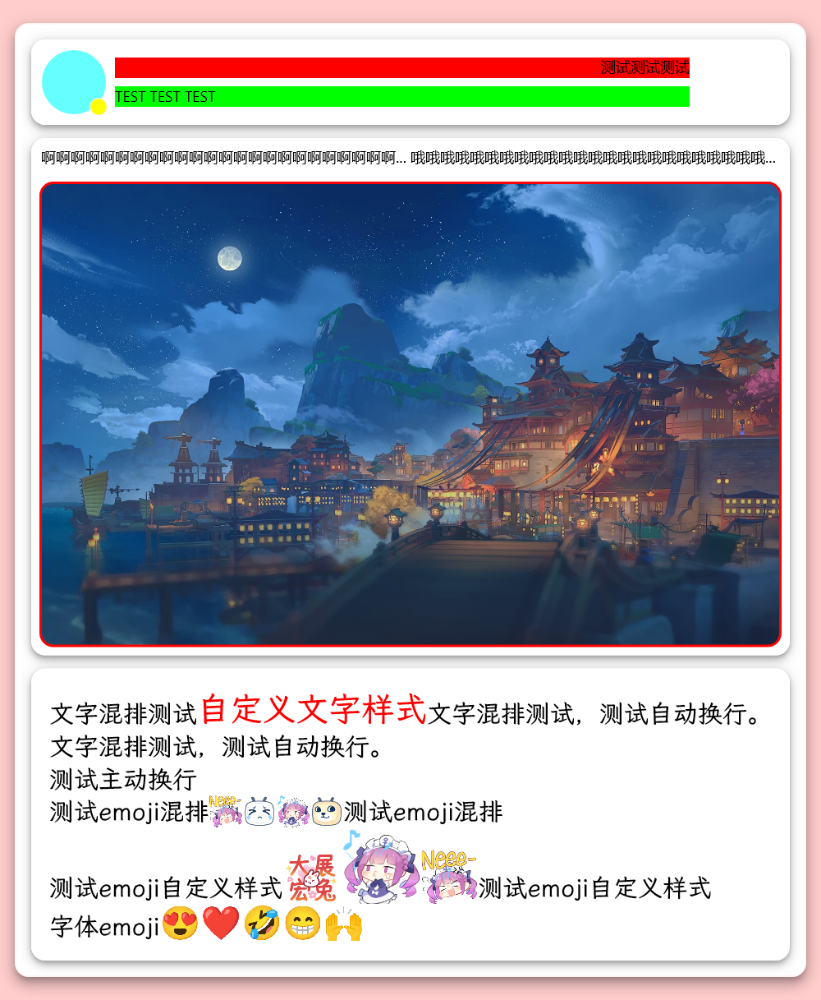
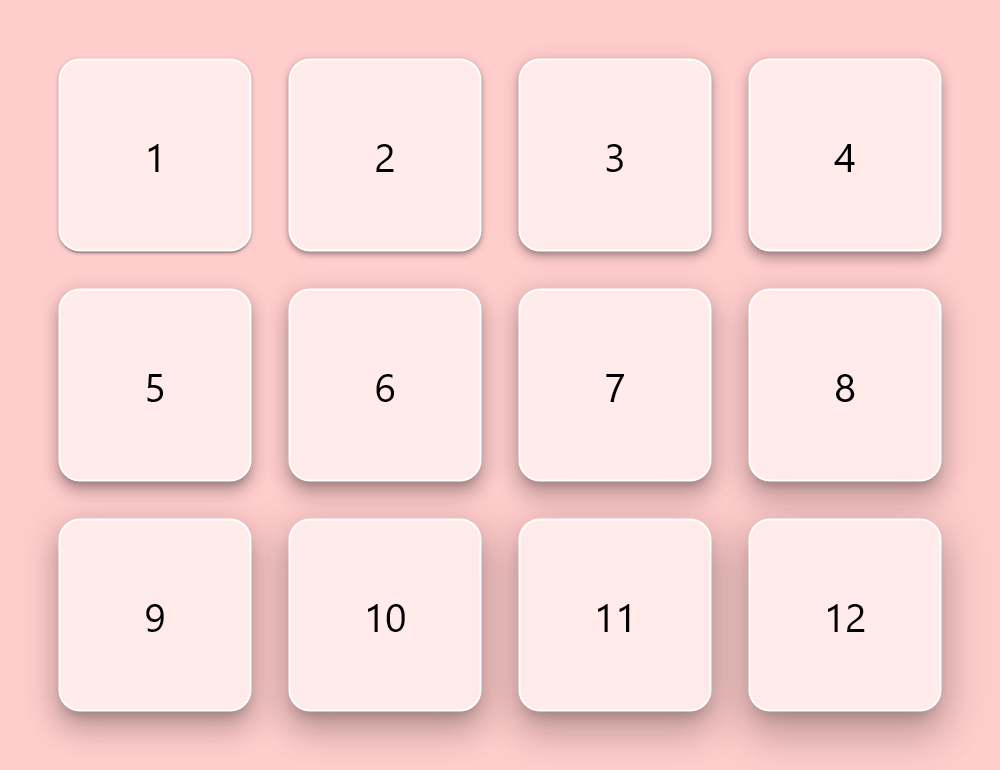

# Skiko Layout

使用 [skiko](https://github.com/JetBrains/skiko) 静态布局绘图

可以非常方便的布局，不需要计算各个元素的大小和位置，类 jetpack compose 的形式

目前还是测试版，会有很多bug，所有api均可能发生变动

以下代码可在 [DrawTest](src/test/kotlin/DrawTest.kt) 中找到

## 使用
### Gradle
```kotlin
implementation("top.colter.skiko:skiko-layout:0.0.2")
```
### Maven
```xml
<dependency>
    <groupId>top.colter.skiko</groupId>
    <artifactId>skiko-layout</artifactId>
    <version>0.0.2</version>
</dependency>
```
## 单位
dp 默认与 px 1:1 转换

可通过 `Dp.factor` 调整整体转换比例

## 元素

### 布局元素
视图 `View` 元素最外层 最好指定宽或高    
列 `Column` 内部元素会自动向下排列    
行 `Row` 内部元素会自动向右排列    
盒子 `Box` 内部元素绝对定位    
宫格 `Grid`    

### 内容元素
图片 `Image`    
文本 `Text` 纯文本元素    
富文本 `RichText` 支持自定义样式与emoji图片    

## 样式
`Modifier`    
宽度 `width`    
高度 `height`    
最小宽度 `minWidth` (暂时没用)    
最小高度 `minHeight` (暂时没用)    
最大宽度 `maxWidth` (暂时没用)    
最大高度 `maxHeight` (暂时没用)    
填充剩余宽度 `fillWidth`    
填充剩余高度 `fillHeight`    
继承父元素宽度 `fillMaxWidth`    
继承父元素高度 `fillMaxHeight`    
按比例继承父元素宽度 `fillRatioWidth`    
按比例继承父元素高度 `fillRatioHeight`    
内边距 `padding`    
外边距 `margin`    
背景 `background` (仅单色背景)    
边框 `border`    
阴影 `shadows`    

## 布局

  

```kotlin
// View视图，最外层。最好指定宽或高
View(
    file = testOutput.resolve("layout1.png"),
    // 样式
    modifier = Modifier()
        .width(1000.dp)
        .background(Color.makeRGB(255, 205, 204))
) {
    // Column 列布局
    Column(Modifier()
        .fillMaxWidth() // 继承父元素宽度
        .margin(horizontal = 20.dp, vertical = 30.dp)
        .padding(20.dp)
        .background(Color.WHITE)
        .border(3.dp, 15.dp, Color.WHITE.withAlpha(0.8f))
        .shadows(Shadow.ELEVATION_5)
    ) {
        Row(Modifier()
            .fillMaxWidth()
            .height(100.dp)
            .padding(10.dp)
            .background(Color.WHITE.withAlpha(0.5f))
            .border(3.dp, 15.dp, Color.WHITE)
            .shadows(Shadow.ELEVATION_3)
        ) {
            Box(Modifier().width(80.dp).fillMaxHeight()) {
                Box(Modifier()
                    .width(80.dp)
                    .height(80.dp)
                    .background(Color.CYAN.withAlpha(0.6f))
                    .border(3.dp, 40.dp)
                )
                Box(modifier = Modifier()
                    .width(20.dp)
                    .height(20.dp)
                    .background(Color.YELLOW)
                    .border(1.dp, 10.dp),
                    alignment = LayoutAlignment.BOTTOM_RIGHT
                )
            }
            Column(Modifier().fillWidth().fillMaxHeight().padding(10.dp)) {
                Box(Modifier().fillMaxWidth().fillHeight().background(Color.RED)) {
                    Box(Modifier().fillMaxWidth().fillMaxHeight()) {
                        Text(text = "测试测试测试", alignment = LayoutAlignment.TOP_RIGHT)
                    }
                }
                Box(Modifier()
                    .fillMaxWidth()
                    .fillHeight()
                    .margin(10.dp, 0.dp, 0.dp, 0.dp)
                    .background(Color.GREEN)
                ) {
                    Box(Modifier().fillMaxWidth().fillMaxHeight()) {
                        Text(text = "TEST TEST TEST")
                    }
                }
            }
            Box(Modifier().width(80.dp).fillMaxHeight()) {  }
        }
        Column(
            Modifier()
                .fillMaxWidth()
                .margin(top = 20.dp)
                .background(Color.WHITE.withAlpha(0.7f))
                .border(3.dp, 15.dp, Color.WHITE)
                .shadows(Shadow.ELEVATION_3)
        ) {
            Row(Modifier().fillMaxWidth().margin(10.dp)) {
                Text(
                    text = "啊啊啊啊啊啊啊啊啊啊啊啊啊啊啊啊啊啊啊啊啊啊啊啊啊啊啊啊啊啊啊啊啊啊啊啊啊啊啊啊啊啊啊",
                    modifier = Modifier().fillWidth()
                )
                Text(
                    text = "哦哦哦哦哦哦哦哦哦哦哦哦哦哦哦哦哦哦哦哦哦哦哦哦哦哦哦哦哦哦哦哦哦哦哦哦哦哦哦哦哦哦哦哦哦",
                    modifier = Modifier().fillWidth()
                )
            }
            Box(Modifier().fillMaxWidth().margin(10.dp)) {
                Image(
                    image = loadTestImage("image", "bg1.jpg"),
                    ratio = 16/10f,
                    modifier = Modifier().border(3.dp, 15.dp, Color.RED)
                )
            }
        }
        RichParagraphTest(
            Modifier()
                .fillMaxWidth()
                .padding(20.dp)
                .margin(top = 20.dp)
                .background(Color.WHITE.withAlpha(0.7f))
                .border(3.dp, 15.dp, Color.WHITE)
                .shadows(Shadow.ELEVATION_3)
        )
    }
}
```

## 宫格 阴影

内置了 Material Design 的阴影规范

  

```kotlin
View(
    file = testOutput.resolve("shadow.png"),
    modifier = Modifier()
        .width(1000.dp)
        .padding(60.dp)
        .background(Color.makeRGB(255, 205, 204))
) {
    Grid (
        maxLineCount = 4, 
        space = 40.dp, 
        modifier = Modifier().fillMaxWidth()
    ) {
        Shadow.elevations.forEachIndexed { index, shadows ->
            Box(Modifier()
                .background(Color.WHITE.withAlpha(0.6f))
                .border(2.dp, 20.dp)
                .shadows(shadows)
            ) {
                Text("${index + 1}", fontSize = 40.dp, alignment = LayoutAlignment.CENTER)
            }
        }
    }
}
```

## 文字

### 富文本构建器
```kotlin
fun Layout.RichParagraphTest(modifier: Modifier) {
    val emojiMap = loadAllTestImage("emoji")

    var currEmoji = "[阿库娅_不关我事]"
    fun randomEmoji(): String {
        currEmoji = emojiMap.keys.random()
        return currEmoji
    }

    val style = TextStyle().setColor(Color.BLACK).setFontSize(30.px).setFontFamily(FontUtils.defaultFont!!.familyName)
    val paragraph = RichParagraphBuilder(style)
        .addText("文字混排测试")
        .addText("自定义文字样式", style.setColor(Color.RED).setFontSize(40.px))
        .addText("文字混排测试，测试自动换行。文字混排测试，测试自动换行。")
        .wrap()
        .addText("测试主动换行")
        .wrap()
        .addText("测试emoji混排")
        .addEmoji(randomEmoji(), emojiMap[currEmoji]!!)
        .addEmoji(randomEmoji(), emojiMap[currEmoji]!!)
        .addEmoji(randomEmoji(), emojiMap[currEmoji]!!)
        .addEmoji(randomEmoji(), emojiMap[currEmoji]!!)
        .addText("测试emoji混排")
        .wrap()
        .addText("测试emoji自定义样式")
        .addEmoji(randomEmoji(), emojiMap[currEmoji]!!, style.setFontSize(50.px))
        .addEmoji(randomEmoji(), emojiMap[currEmoji]!!, style.setFontSize(70.px))
        .addEmoji(randomEmoji(), emojiMap[currEmoji]!!, style.setFontSize(50.px))
        .addText("测试emoji自定义样式")
        .wrap()
        .addText("字体emoji")
        .addText("😍❤️🤣😁🙌", style.setFontSize(40.px).setFontFamily(FontUtils.emojiFont!!.familyName))
        .build()

    Box(modifier) {
        RichText(paragraph)
    }
}
```

## TODO
- [ ] 背景图片
- [ ] 背景渐变色
- [ ] 主题
- [ ] ~~提取图片主题色, 使用 [Material Color Utilities](https://github.com/material-foundation/material-color-utilities)~~ (效果不佳，暂时放弃)
- [ ] more...